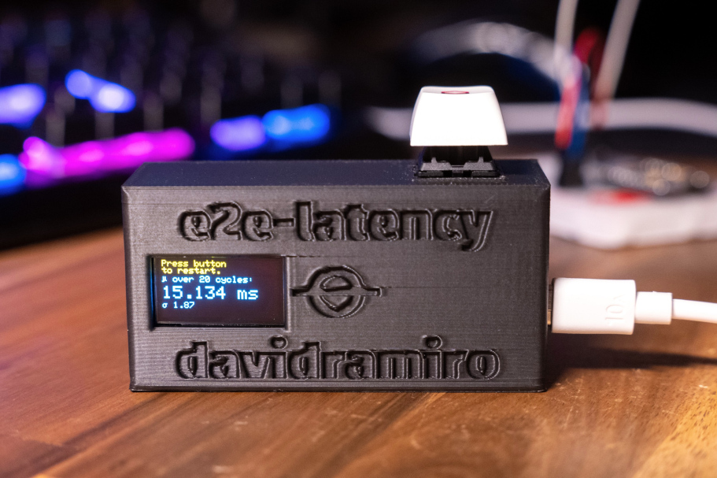

# m2p-latency

Get a rough estimate on mouse-to-photon (time until a mouse input triggers a screen change) system latency by attaching a phototransistor to your screen and measuring response time with an Arduino.

## BoM

- Arduino Pro Micro (ATmega32U4)
- SSD1306 I2C OLED screen
- TEMT6000 phototransistor
- Cherry MX switch

## Wiring

## Usage

- Set up a repeatable test scenario where a mouse click would cause a screen change (e.g. FPS game, mouse latency test at [testufo.com](https://testufo.com/flicker)
- Hold the photo transistor to the screen
- Connect USB
- Press button to start 20 measurements, wait for average to be reported on screen
